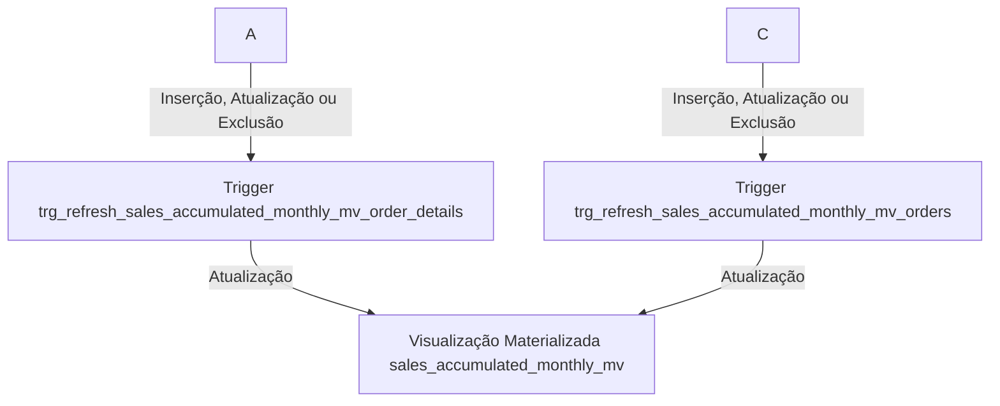
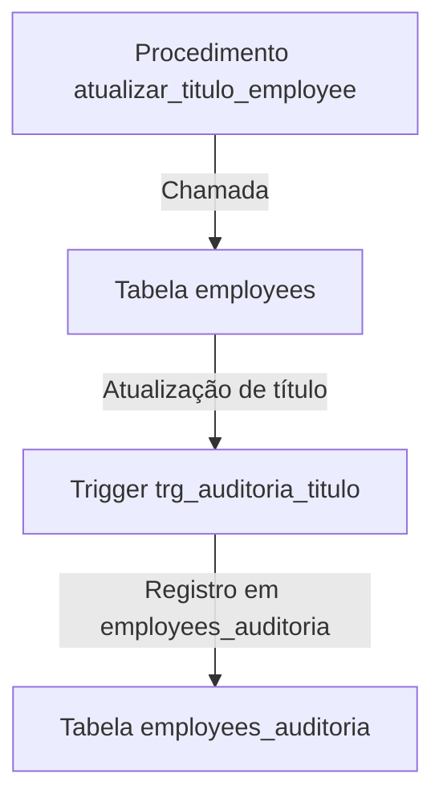

**Objetivo: Exemplificar o Uso de Materialized Views, Triggers e Stored Procedures em um Contexto de Business Intelligence**

Este repositório tem como objetivo apresentar relatórios avançados construídos em SQL, demonstrando a aplicação prática de conceitos fundamentais de Business Intelligence (BI). As análises disponibilizadas aqui são projetadas para serem aplicadas em empresas de todos os tamanhos, ajudando-as a se tornarem mais analíticas e orientadas por dados.

**Como Funciona:**

1. **Materialized Views:** As Materialized Views são utilizadas para pré-calcular e armazenar resultados de consultas complexas. Neste cenário, as Materialized Views são empregadas para melhorar o desempenho de consultas frequentes e fornecer acesso rápido a dados agregados essenciais para análises.
    
2. **Triggers:** Triggers são mecanismos que permitem a execução automática de ações em resposta a eventos específicos no banco de dados. Neste contexto, as Triggers são empregadas para garantir a integridade dos dados e aplicar lógica de negócios, como validações e atualizações automáticas.
    
3. **Stored Procedures:** Stored Procedures são conjuntos de instruções SQL pré-compiladas e armazenadas no banco de dados. Elas podem ser chamadas repetidamente para executar tarefas complexas de forma eficiente e consistente. Neste caso, as Stored Procedures são utilizadas para automatizar processos de ETL (Extração, Transformação e Carregamento) e realizar operações avançadas de manipulação de dados.

**Benefícios:**

* **Extração de Insights Valiosos:** Os relatórios avançados disponibilizados neste repositório permitem que as organizações extraiam insights valiosos de seus dados, proporcionando uma compreensão mais profunda de seus processos e desempenho.
* **Apoio à Tomada de Decisões Estratégicas:** Com acesso a análises detalhadas e atualizadas, as empresas podem tomar decisões estratégicas mais informadas e direcionadas, impulsionando o crescimento e a eficiência operacional.]

**Caso Materialized View:**

Este conjunto de comandos SQL define uma ETL (Extração, Transformação e Carregamento) para gerar um relatório de vendas acumuladas mensais. A ETL consiste em uma visualização materializada chamada `sales_accumulated_monthly_mv` e duas triggers que garantem que a visualização seja atualizada sempre que houver alterações nas tabelas `order_details` e `orders`.

1. **Visualização Materializada (`sales_accumulated_monthly_mv`):** Esta visualização materializada calcula a soma acumulada das vendas mensais. Ela extrai o ano e o mês da data do pedido e calcula a soma das vendas para cada mês. Os resultados são agrupados por ano e mês.
    
2. **Trigger para Atualização da Visualização (`trg_refresh_sales_accumulated_monthly_mv_order_details` e `trg_refresh_sales_accumulated_monthly_mv_orders`):** Duas triggers foram criadas para garantir que a visualização materializada seja atualizada sempre que houver alterações nas tabelas `order_details` e `orders`. Quando ocorrerem inserções, atualizações ou exclusões nessas tabelas, as triggers acionarão a função `refresh_sales_accumulated_monthly_mv`, que atualizará a visualização materializada.

**Caso Stored Procedured:**

Este conjunto de comandos SQL visa monitorar e atualizar alterações nos títulos dos funcionários na tabela `employees` e registrar essas mudanças na tabela `employees_auditoria`.

1. **Tabela de Auditoria de Funcionários (`employees_auditoria`):** Uma tabela foi criada para registrar as mudanças nos títulos dos funcionários. Ela possui os seguintes campos:
    
    * `employee_id`: O ID do funcionário afetado.
    * `nome_anterior`: O título anterior do funcionário.
    * `nome_novo`: O novo título do funcionário.
    * `data_modificacao`: A data e hora da modificação (com o valor padrão definido como o momento atual).
2. **Trigger para Auditoria de Títulos (`trg_auditoria_titulo`):** Uma trigger foi criada para ser acionada após a atualização do título na tabela `employees`. Esta trigger chama uma função que registra a mudança na tabela `employees_auditoria`.
    
3. **Procedimento para Atualização de Título (`atualizar_titulo_employee`):** Uma stored procedure foi criada para facilitar a atualização do título de um funcionário. Ela aceita o ID do funcionário e o novo título como parâmetros e executa uma atualização na tabela `employees`.

**Conclusão:**

Este repositório oferece uma oportunidade única para empresas de todos os setores aproveitarem o poder do Business Intelligence por meio de relatórios avançados em SQL. Ao adotar essas práticas, as organizações podem transformar dados em insights acionáveis, impulsionando o sucesso e a inovação em um ambiente competitivo.

